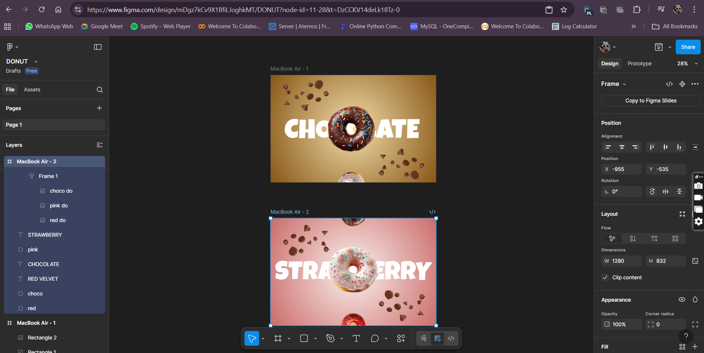
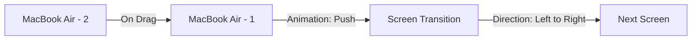
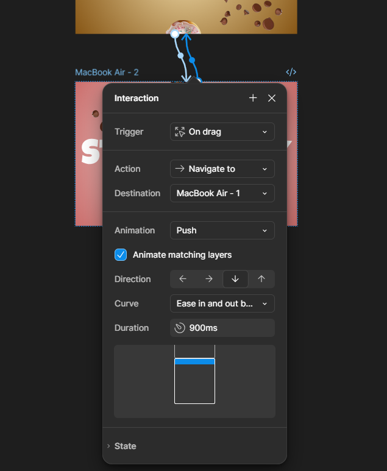
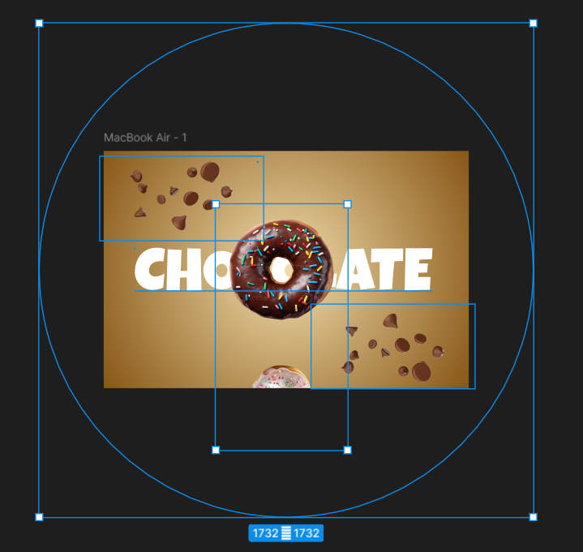

# DONUT (Figma Prototype)

[Live Prototype — View in Figma](https://www.figma.com/proto/mDgz7kCv9X1BfiLJoghkMT/DONUT?node-id=3-3&p=f&t=2c4ww5vjYPg83QCH-1&scaling=scale-down&content-scaling=fixed&page-id=0%3A1)

---

## Table of Contents

1. [About](#about)  
2. [Motivation & Goals](#motivation--goals)  
3. [Features & Screens](#features--screens)  
4. [User Flows](#user-flows)  
5. [Technology & Tools](#technology--tools)  
6. [How to Use](#how-to-use)  
7. [Credits & Acknowledgments](#credits--acknowledgments)  
---

## About

**DONUT** is a design prototype built in Figma.  
It illustrates the user interface, experience flows, and key interactions of the envisioned product.  
This repository holds the prototype link, design rationale, and related assets.

---

## Motivation & Goals

- Visualize the core user journey and validate UX before development  
- Communicate design to stakeholders, developers, and teammates  
- Iterate quickly on layout, navigation, and interactions  
- Test user flows, transitions, and micro-interactions  

---

## Features & Screens

Below is an overview of main screens and features:

| Screen / Feature | Description |
|------------------|-------------|
| **Home / Dashboard** | The landing view where users see their summary and recent items |
| **Detail / Item View** | When selecting an item, view its full details and actions |
| **Create / Add New** | Screen or modal to create a new item, entry, or record |
| **Edit / Settings** | Interface to configure or modify existing content |
| **Transitions & Animations** | flowchart LR|
| **Navigation** | Bottom nav, side menu, or tab bar for moving between core sections |

# Interaction Flow (Figma Prototype)

---

## User Flows

Here are sample flows described in the prototype:

1. **Onboarding → Dashboard**  
   New user lands on onboarding screens, then proceeds to the main dashboard.

2. **Dashboard → Detail → Edit → Save → Dashboard**  
   Selecting an item opens detail, then the user can edit and return.

3. **Dashboard → Create New → Submit → Dashboard**  
   User taps “Add” → sees creation form → submits → list updates.

You may wish to include a visual flowchart or link to your flow diagram as well.

---

## Technology & Tools

- **Figma** — for designing screens, prototyping interactions, and sharing links  
- **Git / GitHub** — version control, hosting README, design documentation
- 
- 
- [red velvet donut](a79c3c7ed953e8b51c3b006323933316-removebg-preview.png)
- 
- 

---

## How to Use

1. Click the [Live Prototype link](https://www.figma.com/proto/mDgz7kCv9X1BfiLJoghkMT/DONUT?node-id=3-3&p=f&t=2c4ww5vjYPg83QCH-1&scaling=scale-down&content-scaling=fixed&page-id=0%3A1) to open the interactive prototype in Figma.  
2. Navigate through screens using the built interactions or Figma’s prototype controls.
3. 

---

## Credits & Acknowledgments

- **Design lead / Author**: Ananya Rakhi Singh    
- **Inspiration / References**: (https://youtu.be/3TkgS5WIFi4?si=CCILvNgOhvxB6dny)

---

